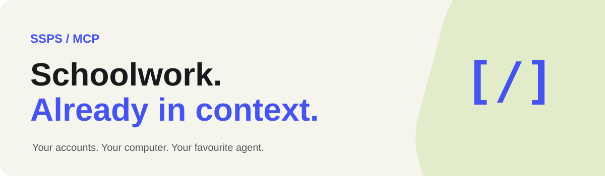

Give your agent the context for schoolwork: **Bakaláři, Teams and Discord**, using your own accounts.

[Install page](https://sspsmcp.kaooffline.top) · [Setup & recovery](docs/one-command-setup.md) · [Teams feature map](docs/teams-access-and-features.md)

## One command

Install **Git**, **Node.js 22.13+** (with npm) and **Google Chrome**, then open a terminal.

**Windows · PowerShell**

```powershell
irm https://sspsmcp.kaooffline.top/install.ps1 | iex
```

**macOS / Linux · Bash**

```bash
curl -fsSL https://sspsmcp.kaooffline.top/install.sh | bash
```

You can [inspect the Windows script](site/public/install.ps1) or [Bash script](site/public/install.sh) before running it.

1. Sign in to your own accounts. Teams uses Chrome; the default flow needs no Microsoft app registration.
2. Watch the first cache load. Setup shows progress before it finishes; the rest loads in the background.
3. Open a new session in your agent and ask: **“What homework is due this week?”**

Setup detects supported installed apps, adds MCP configuration and installs skills where supported. Includes Hermes, Codex, Claude, Grok, Gemini, Cursor and more. Unknown apps get manual import instructions; hosted agents need a separate connection.

## What it reads

- **Bakaláři:** homework, messages, marks, timetable and available lesson context.
- **Teams:** assignments, deadlines, announcements and accessible document context.
- **Discord:** accessible servers and DMs exposed by your session. History is partial until visited and cached.

Cached context responds quickly. Background readers check for changes; freshness is reported. The integration is read-only.

## Your data

Accounts, browser sessions and caches stay on **your computer**. The install website hosts only public files. On Windows, saved token/cache files use your Windows account’s encryption; other systems use private file permissions. Chrome keeps its own local profile.

This does store a local cache. Your agent’s AI provider may receive the context you ask it to use. Do not share your private data folder or send passwords in agent chats.

## Already cloned?

```bash
node scripts/setup.mjs
```

Use `--detect` to list apps, `--apps=hermes,codex,claude,grok` to select them, or `--sources=teams,bakalari` to skip Discord. [Full options and supported clients →](docs/one-command-setup.md)

For development: `npm ci`, then `npm run check`. [Website deployment →](docs/site-deployment.md)
